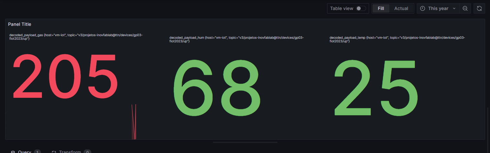
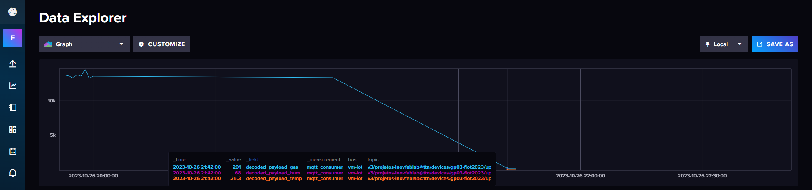

# RMA-Robo_Monitoramento

O RMA, ou Robô de Monitoramento Ambiental, foi um projeto que foi desenvolvido com o intuito de realizar o monitoramento de rotina em ambientes industriais em que são utilizados gases potencialmente nocivos tanto ao meio ambiente quanto à saúde humana, como metano, butano, propano e fumaça. As informações coletadas pelos sensores são enviadas aos operadores do local de uma forma detalhada, para que possam identificar e determinar com segurança a melhor maneira de solucionar potenciais problemas. Essa inspeção é realizada remotamente, onde um técnico pode controlar o robô e sua câmera para monitorar o que for necessário.

O projeto foi desenvolvido com o uso de uma plataforma de desenvolvimento ESP-32, juntamente com os sensores de gases MQ-2 e sensor de temperatura e umidade DHT-11.
Além disso, os dados coletados são armazenados em um banco de dados Azure, da Microsoft, e a comunicação com o projeto físico foi possível por meio do uso do protocolo
LoRaWAN, e a plataforma do The Things Network (TTN) com o protocolo MQTT.

Os dados coletados e tratados são dispostos em painéis, com valores respectivos a presença de gases no ambiente em que o robô está, juntamente com gráficos destas
informações em horas passadas.

O projeto foi entregue durante bacharelado de engenharia de computação, e foi desenvolvido em conjunto com os colegas Manoela Alvares de Abreu Oliveira, Eduardo Guimarães Corrêa e Luiz Ricardo Fávaro Corrêa